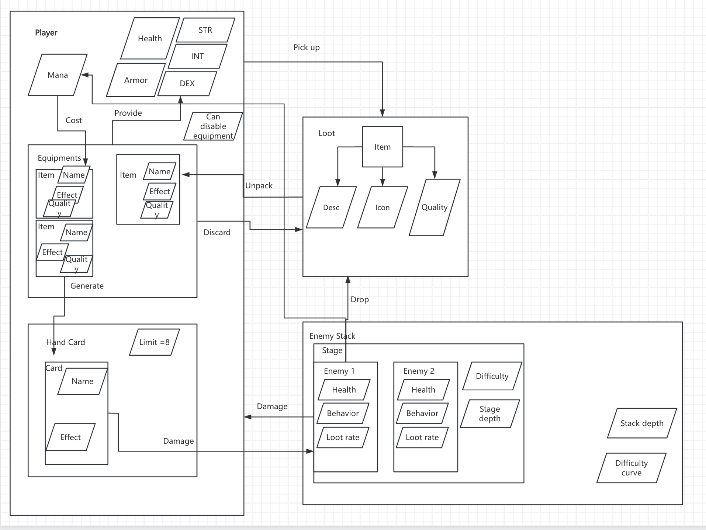

# Overdraw Squad

Overdraw Squad is a real-time roguelike card combat game.



Current progress:
- [x] Basic card system
- [x] Basic equipment system
- [x] Basic entity system
- [x] Intent system
- [x] Standard card set
- [ ] Standard equipment set
- [ ] Standard entity set
- [ ] Standard stage set
- [ ] Multiplayer
- [x] Extensibility 

## How to add a card?

1. Create a folder named `your_mod_name` under `assets/card/` and `card_scripts/`.
2. Open `data/card_database.json`, add your card's data in this format:
   ```
   "your_mod_name":{
     "card_name":{
       "type": attack/defend/magic,
       "card_name": "name in code",
			 "card_display_name": "name that appears on the card",
			 "card_display_name_bbcode": "[font=res://assets/font/dpcomic.ttf][color=#271c40][outline_size=2][font_size=18][outline_color=white][center] Do not change this unless it does not look right",
			 "card_desc": "description in code (useless)",
			 "card_display_desc": "description that appears on the card",
			 "card_display_desc_bbcode": "[font=res://assets/font/retganon.ttf][font_size=16][center] Do not change this unless it does not look right",
			 "card_resource": "the file name of the resource with extension name, must be under assets/card/your_mod_name/ Example: attack.png"   
     } 
   }
   ``` 
3. Create a file named `your_card_name.gd` under `card_scripts/your_mod_name/` in this format:
   ```
   Extends Card

   func _on_card_play():
     pass

   # Check core/card.gd and core/gamemanager.gd for available functionalities
   ```
4. Add a image with a size of 80*57 pixels as `assets/card/your_mod_name/card_name.png`
5. Debug the project in Godot Engine, ensuring that it can successfully run. You may edit the `debug` section in `core/gamemanager.gd` for fast debugging.
